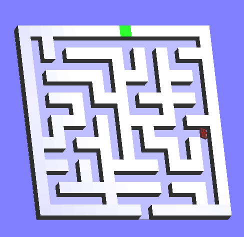

# **Hunters Maze Game Portfolio Project**

**Introduction**

The Hunters Maze Game is meant to provide a seamless and engaging gameplay experience, creating a maze game requires many critical technological and architectural concerns. There is a top-down shooter where the player's objective is to survive waves of enemies. You want to create an enemy AI behavior that presents a significant challenge to players.

**Features**

